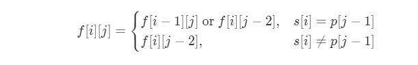
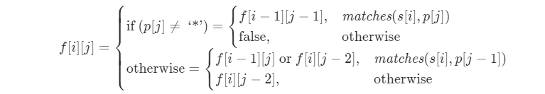

## 题目

给你一个字符串 s 和一个字符规律 p，请你来实现一个支持 '.' 和 '*' 的正则表达式匹配。

'.' 匹配任意单个字符
'*' 匹配零个或多个前面的那一个元素
所谓匹配，是要涵盖 整个 字符串 s的，而不是部分字符串。


示例 1：

输入：s = "aa" p = "a"
输出：false
解释："a" 无法匹配 "aa" 整个字符串。
示例 2:

输入：s = "aa" p = "a*"
输出：true
解释：因为 '*' 代表可以匹配零个或多个前面的那一个元素, 在这里前面的元素就是 'a'。因此，字符串 "aa" 可被视为 'a' 重复了一次。
示例 3：

输入：s = "ab" p = ".*"
输出：true
解释：".*" 表示可匹配零个或多个（'*'）任意字符（'.'）。
示例 4：

输入：s = "aab" p = "c*a*b"
输出：true
解释：因为 '*' 表示零个或多个，这里 'c' 为 0 个, 'a' 被重复一次。因此可以匹配字符串 "aab"。
示例 5：

输入：s = "mississippi" p = "mis*is*p*."
输出：false


提示：

0 <= s.length <= 20
0 <= p.length <= 30
s 可能为空，且只包含从 a-z 的小写字母。
p 可能为空，且只包含从 a-z 的小写字母，以及字符 . 和 *。
保证每次出现字符 * 时，前面都匹配到有效的字符

来源：力扣（LeetCode）
链接：https://leetcode-cn.com/problems/regular-expression-matching
著作权归领扣网络所有。商业转载请联系官方授权，非商业转载请注明出处。

## 题解

### 动态规划

使用数组`f[i][j]`表示s的前i个字符与p中的前j个字符能否匹配。

- 如果 p 的第 j 个字符是一个小写字母，那么我们必须在 s 中匹配一个相同的小写字母，状态转移方程为：


- 如果 p的第 j 个字符是 `*`，那么就表示我们可以对 p的第 j-1 个字符匹配任意自然数次，状态转移方程为：



- 在任意情况下，只要 p[j] 是 `.`，那么 p[j] 一定成功匹配 s 中的任意一个小写字母。

最终得到的状态转移方程为：



时间复杂度O(n * m)，空间复杂度O(n * m)。

```c++
class Solution {
public:
    bool match(int i, int j, string &s, string &p) { //匹配
        if (i == 0) {
            return false;
        }
        if (p[j - 1] == '.') {
            return true;
        }
        return s[i - 1] == p[j - 1];
    }
    bool isMatch(string s, string p) {
        int n = s.size(), m = p.size();
        vector<vector<int>> f(n + 1, vector<int>(m + 1));
        f[0][0] = true;
        //动态规划，状态转移
        for(int i = 0; i <= n; i++) {
            for (int j = 1; j <= m; j++) {
                if (p[j - 1] != '*') {
                    if (match(i, j, s, p)) {
                        f[i][j] |= f[i - 1][j - 1];
                    }
                } else {
                    f[i][j] |= f[i][j - 2];
                    if (match(i, j - 1, s, p)) {
                        f[i][j] |= f[i - 1][j];
                    }
                }
            }
        }
        return f[n][m];
    }
};
```

