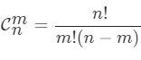
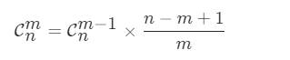

## 题目

给定一个非负索引 k，其中 k ≤ 33，返回杨辉三角的第 k 行。


在杨辉三角中，每个数是它左上方和右上方的数的和。

示例:

输入: 3
输出: [1,3,3,1]
进阶：

你可以优化你的算法到 O(k) 空间复杂度吗？

来源：力扣（LeetCode）
链接：https://leetcode-cn.com/problems/pascals-triangle-ii
著作权归领扣网络所有。商业转载请联系官方授权，非商业转载请注明出处。

## 题解

### 递推

使用递推得到整个杨辉三角，然后返回所生成的杨辉三角的最后一行即可。

时间复杂度O(n<sup>2</sup>)，空间复杂度O(n<sup>2</sup>)。

```c++
class Solution {
public:
    vector<int> getRow(int rowIndex) {
        vector<vector<int>> res(rowIndex + 1);
        for (int i = 0; i <= rowIndex; i++) {
             for (int j = 0; j <= i; j++) {
                if (j == 0 || j == i) {
                    res[i].push_back(1);
                } else {
                    res[i].push_back(res[i- 1][j] + res[i - 1][j - 1]);
                }
             }
        }
        return res[rowIndex];
    }
};
```

### 滚动数组改进

分析上述代码可知，每次结果只与上一次结果有关，所以可以使用滚动数组的方式降低空间复杂度。使用pre保存上一次结果，cur保存当前结果，最终返回cur即可。

时间复杂度O(n<sup>2</sup>)，空间复杂度O(n)。

```c++
class Solution {
public:
    vector<int> getRow(int rowIndex) {
        vector<int> pre, cur;
        for (int i = 0; i <= rowIndex; i++) {
            cur.resize(i + 1);
            cur[0] = cur[i] = 1;
            for (int j = 1; j < i; j++) {
                cur[j] = pre[j -1] + pre[j];
            }
            pre = cur;
        }
        return cur;
    }
};
```

### 单数组优化

可以倒序经行计算当修改到第i项时，第i - 1项仍然是上一行的值，所以只用一个数组即可解决。

时间复杂度O(n<sup>2</sup>)，空间复杂度O(1)。

```c++
class Solution {
public:
    vector<int> getRow(int rowIndex) {
        vector<int> res(rowIndex + 1);
        res[0] = 1;
        for (int i = 0; i <= rowIndex; i++) {
            for (int j = i; j > 0; j--) {
                res[j] += res[j - 1];
            }
        }
        return res;
    }
};
```

### 递推公式法

杨辉三角的数学意义为组合数公式，第n行第m个数为

故可用递推公式求解。

*注意在乘的过程中会爆int范围先用要先乘1LL转换成long long类型进行计算。*

时间复杂度O(n)，空间复杂度O(1)。

```c++
class Solution {
public:
    vector<int> getRow(int rowIndex) {
        vector<int> res(rowIndex + 1);
        res[0] = 1;
        for (int i = 1; i <= rowIndex; i++) {
            res[i] = 1LL * res[i - 1] * (rowIndex - i + 1) / i;
        }
        return res;
    }
};
```

