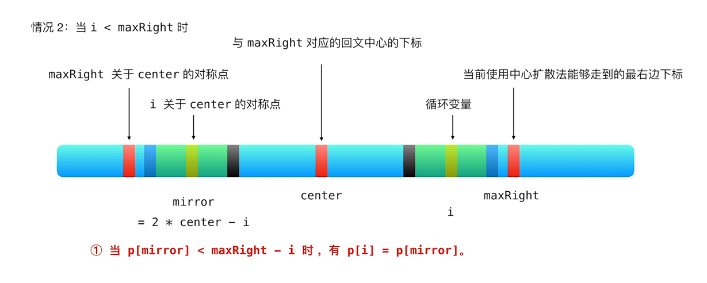

## 题干

给你一个字符串 s，找到 s 中最长的回文子串。

 

示例 1：

输入：s = "babad"
输出："bab"
解释："aba" 同样是符合题意的答案。
示例 2：

输入：s = "cbbd"
输出："bb"
示例 3：

输入：s = "a"
输出："a"
示例 4：

输入：s = "ac"
输出："a"


提示：

1 <= s.length <= 1000
s 仅由数字和英文字母（大写和/或小写）组成

来源：力扣（LeetCode）
链接：https://leetcode-cn.com/problems/longest-palindromic-substring
著作权归领扣网络所有。商业转载请联系官方授权，非商业转载请注明出处。

## 题解

### 暴力法(TLE)

暴力法使用两重循环遍历整个字符串的所有子串，并逐一判断是否为回文，记录其中最长的回文子串并返回。通过增加判断如果当前子串长度大于当前已获得的最大回文子串长度，再判断当前子串是否为回文来进行优化，但任然TLE。

时间复杂度O(n^4)，空间复杂度O(1)。

```c++
class Solution {
public:
    string longestPalindrome(string s) {
        int len = s.length();
    if (len < 2)
    {
        return s;
    }
    int begin = 0;
    int maxlen = 1;
    for (int i = 0; i < len - 1; i++)
    {
        for (int j = i + 1; j < len; j++)
        {
            if (j - i + 1 > maxlen && CheckPalindrome(s, i, j))// 判断当前子串长度是否大于当前最大回文子串，若大于再判断当前子串是否为回文
            {
                maxlen = j - i + 1;
                begin = i;
            }
        }
    }
    return s.substr(begin, maxlen);
    }
    bool CheckPalindrome(string s, int left, int right) //判断从left到right长度的子串是否为回文
    {
        while (left < right)
        {
            if (s[left] != s[right])
            {
                return false;
            }
            left++;
            right--;
        }
        return true;
    }
};
```

### 动态规划法

对于一个子串而言，如果它是回文串，且长度大于2，那么将它的首尾两字母去掉后的子串任然是回文串，所以只有s[i + 1, j - 1]是回文串且是s[i] = s[j]时，s[i, j]才是回文串，所以可以采用动态规划的方法来解决。用dp[i, j]表示从i到j的子串是否为回文串，可得状态转移方程为：dp[i, j] = dp[i + 1, j - 1] ^ (s[i] == s[j])。

时间复杂度O(n^2),空间复杂度O(n^2)。

```c++
class Solution {
public:
    string longestPalindrome(string s) {
        int len = s.length();
    if (len < 2)
    {
        return s;
    }
    int begin = 0;
    int maxlen = 1;
    vector<vector<bool>> dp(len, vector<bool>(len));
    for (int j = 1; j < len; j++)
    {
        for (int i = 0; i < j; i++)
        {
            if (s[i] == s[j] && (dp[i + 1][j - 1] || j - i < 3))
            {
                dp[i][j] = true;
            }
            if (dp[i][j] && j - i + 1 > maxlen)
            {
                maxlen = j - i + 1;
                begin = i;
            }
            
            
        }
    }
    return s.substr(begin, maxlen);
    }
};
```

## 中心扩散法

观察可得，所有的回文串都有一个对称中心，所以可以从对称中心入手，对对称中心向两边进行扩散，即如果两侧相等则继续扩散，若不相等则返回，枚举所有的对称中心，得到最长的回文子串。由于不同奇数长度与偶数长度的回文子串对称中心不同，所以扩散两次，奇数长度以中间串作为回文中心，偶数串以中间两个作为回文中心，取最长的作为最终结果。

时间复杂度O(n^2)，空间复杂度O(1)。

```c++
class Solution {
public:
int ExpandAroundCenter(const string &s, int left, int right)//对回文中心进行中心扩散
    {
        int len = s.length();
        int i = left;
        int j = right;
        while (i >= 0 && j < len)
        {
            if (s[i] == s[j])
            {
                i--;
                j++;
            }
            else
            {
                break;
            }
        }
        return j - i - 1;
    }
    string longestPalindrome(string s) {
        int len = s.length();
    if (len < 2)
    {
        return s;
    }
    int begin = 0;
    int maxlen = 1;
    for (int i = 0; i < len - 1; i++)
    {
        int oddlen = ExpandAroundCenter(s, i, i);//扩散奇数长度的回文子串
        int evenlen = ExpandAroundCenter(s, i, i + 1);//扩散偶数长度的回文子串
        if (max(oddlen, evenlen) > maxlen)
        {
            maxlen = max(oddlen, evenlen);
            begin = i - (maxlen - 1) / 2;
        }
    }
    return s.substr(begin, maxlen);
    }
};
```

### Manacher 算法

对于求最长回文子串有一种专门的算法——Manacher算法。结合动态规划用空间换时间的方法与中心扩散的方法，让时间复杂度缩短到O(n)，空间复杂度O(n)。

首先为了将奇、偶数回文串的性质统一表示，将原始字符串进行预处理，将每两个字符串中间加一个字符串中不会出现的相同符号，例如`#`，得到一个新的字符串。这样(预处理字符串的回文子串的长度 - 1) / 2 = 原始字符串的回文子串的长度 = 以i为中心向两边扩散的步数。

分为以下两种种情况进行判断：





*上述图片取自LeetCode官方题解视频截图，地址https://leetcode-cn.com/problems/longest-palindromic-substring/solution/zui-chang-hui-wen-zi-chuan-by-leetcode-solution/*

根据上述分析得到代码如下：

```c++
class Solution {
public:
    string longestPalindrome(string s) {
        int len = s.length();
    if (len < 2)
    {
        return s;
    }
    int begin = 0;
    int maxlen = 1;
    string temp = "#";
    for (char c : s)
    {
        temp += c;
        temp += '#';
    }
    int tlen = 2 * len + 1;
    int center = 0, maxright = 0;
    vector<int> p(tlen);
    for (int i = 0; i < tlen; i++)
    {
        if (i < maxright)
        {
            int mirror = 2 * center - i;
            p[i] = min(maxright - i, p[mirror]); //状态转移方程
        }
        int left = i - (1 + p[i]), right = i + (1 + p[i]);
        while (left >= 0 && right < tlen && temp[left] == temp[right])
        {
            p[i]++;
            left--;
            right++;
        }
        if (i + p[i] > maxright)
        {
            maxright = i + p[i];
            center = i;
        }
        if (p[i] > maxlen)
        {
            maxlen = p[i];
            begin = (i - maxlen) / 2;
        }
    }
    return s.substr(begin, maxlen);
    }
};
```

